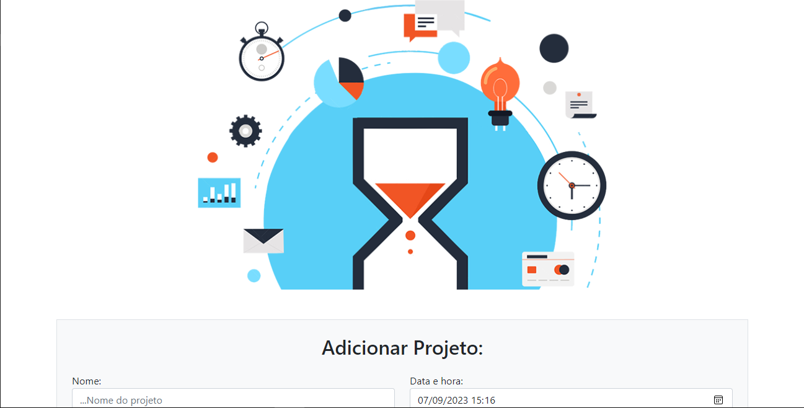

<div align=center>

   💻 **WCore Testing Project**
<br>
<br> 
   
   
</div>

<br>

## Recursos de Usuário

- Adicionar, Visualizar, Concluir e Remover Projeto.

## Como usar?

### Pré-requisitos

- Necessário instalar a versão mais recente do Visual Studio Community 2022;
- Versão mais recente (ou a mais estável) do .NET 6;
- Entity Framework Core 6

### Instalação
Siga os passos abaixo para ter acesso ao seu ambiente de desenvolvimento:

1. Clone o repositório:
```csharp
   git clone https://github.com/GabrielFSouza/WCoreTesting
```

2. Criar conexao com o banco de dados pelo Visual Studio(**OPCIONAL**): 
	- SQL Server Object Explorer > SQL Server > Databases 
    - Clicar com o Botão direito em cima de Database e selecionar **ADD New Database** coloque o nome **ToDoListDB**

3. Configure a string de conexão no arquivo **appsettings.json** apontando para o seu banco de dados SQL Server **caso voce tenha colocado outro nome**;

4. Para criar o banco de dados SQL Server e suas respectivas tabelas, abra o **Package Manager Console** em seu Visual Studio e digite os comandos: 
    - Criação das tabelas do Identity: Abra o Console do Gerenciador de Pacotes > **Acima em Projeto padrão**: Selecione **ToDoList**. Execute os comandos abaixo:
        ```csharp
            Add-Migration InitialCreate -Context MyDatabaseContext
        ```

    - Criação das tabelas: 
        ```csharp
            Update-Database -Context MyDatabaseContext
        ```

5. Pressione `F5 ou Ctrl+F5` para rodar o projeto no seu navegador.
